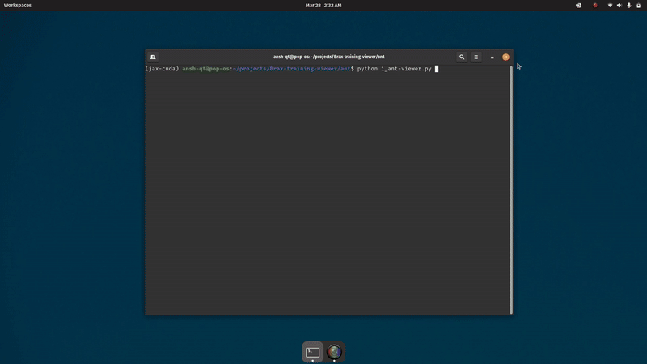

# Brax-training-viewer 
# Brax Training Viewer coding example

## Overview

This coding example demonstrates training and visualizing a reinforcement learning policy for the **Ant** environment in Brax. It integrates **JAX**, **Brax**, and **MuJoCo** to efficiently train policies using PPO and visualize them in real-time.
This coding example is part of the necessary requirement for the open-source project #### Brax Training Viewer for Real-Time Policy Visualization from [PAL Robotics]("https://pal-robotics.com/")

---

##  Cloning and installation

Before running the scripts, clone the repository :
```sh
git clone https://github.com/De-funkd/Brax-training-viewer.git
```
navigate to the cloned repository :
```sh
cd Brax-training-viewer 
```
install the requirements : 
```sh
pip install -r requirements.txt
```

Make sure you have **MuJoCo** installed and properly set up.

---

## Tasks Overview

This project consists of **four major tasks**:

### 1️Creating a simulation 

**Goal:** Using MuJoCo Python bindings, create a simulation with the [Ant robot](https://github.com/openai/gym/blob/master/gym/envs/mujoco/assets/ant.xml) and apply random controls to its joints. Show the simulation using

```
mujoco.viewer
```

🔹 **Script:** `1_ant-viewer.py`

🔹 **Key Functions Used:**

```python
model = mujoco.MjModel.from_xml_path("ant.xml")
```
**Purpose**: Loads a MuJoCo model from an XML file (`ant.xml`) and returns a `MjModel` object containing the model’s structure (e.g., joints, bodies, actuators).

```python
**`mujoco.viewer.launch_passive(model, data)`**
```
**Purpose**:Launches a **passive viewer** for visualizing the simulation. The viewer runs in a separate thread and syncs with the simulation data.

```python
**`np.random.uniform(-1, 1, size=model.nu)`**
```
**Purpose**:Generates a **random action vector** (uniformly distributed between `-1` and `1`) for all actuators (`model.nu` gives the number of actuators).

**Command to run:**
navigate to folder ant : 
```sh
cd ant 
```
then run : 
```sh
python 1_ant-viewer.py
```

**output:** 


---

### 2️Multi-simulation 

**Goal:** Create a Python function that gets as input parameters `num_envs`, `env_separation`, and `ens_per_row`; it also receives the MuJoCo XML model and replicates the robot as many times as needed in the same model. Simulate the new replicated model and control all the robots by applying random actions.

🔹 **Script:** `2_multi-ant-viewer.py`

🔹 **Key functions used:**

```python
def replicate(num_envs, env_separation, envs_per_row, xml_string): spec = mujoco.MjSpec.from_string(xml_string) spec.copy_during_attach = True new_spec = mujoco.MjSpec() new_spec.copy_during_attach = True colors = generate_unique_colors(num_envs)
```
**Purpose**: This part of your code initializes the core setup for replicating multiple MuJoCo environments.

**Additional functionality of the script**:
- Can be generalized to any xml file(here we use ant.xml and half-cheetah.xml)
- Takes name of xml to be generated as input from user 
- Takes number of replicated agent to be generated as input from user
- Assigns unique color to each agent to easily keep track of each body
- The script **prints the average position** (x,y,z) of all agents, which helps monitor collective behavior.
- Arranges agents in a grid using `env_separation` and `envs_per_row`
- Instead of **modifying and duplicating the original XML file manually**, it programmatically **constructs a new MuJoCo model** using `MjSpec`.This method is more **flexible, scalable, and reusable** compared to hard-coding multiple agents in the XML file.
- The script doesn't just **replicate** agents—it also **controls them dynamically** using:
 
```python
 data.ctrl[:] = np.random.uniform(-1, 1, size=model.nu)
 ```

**Command to run:**
navigate to folder ant : 
```sh
cd ant 
```
then run : 
```sh
python 2_multi-ant-viewer.py
```

**output:** 

.gif)

.gif)


---

### 3️ Brax training 

**Goal:** Use the [Ant Brax](https://github.com/google/brax/blob/main/brax/envs/ant.py) environment and train a control policy using Brax’ PPO implementation.

🔹 **Script:** `3_brax-training.py`

🔹 **Key Function:**

```python
num_timesteps = 50_000_000
train_fn = functools.partial(
    ppo.train,
    num_timesteps=num_timesteps,
    num_evals=10,
    reward_scaling=10,
    episode_length=1000,
    normalize_observations=True,
    action_repeat=1,
    unroll_length=5,
    num_minibatches=32,
    num_updates_per_batch=4,
    discounting=0.97,
    learning_rate=3e-4,
    entropy_cost=1e-2,
    num_envs=4096,
    batch_size=2048,
    seed=1
)
```
***
**Purpose:**
- Configures and initializes the **Proximal Policy Optimization (PPO) training process** with hyperparameters like learning rate, batch size, and discount factor.
- Defines the RL algorithm's behavior (e.g., how aggressive updates are, how exploration is balanced via entropy).
- Sets up parallel environments (`num_envs=4096`) for efficient training
- Without this, you couldn’t train the agent at all—it’s the core of the learning process.

Additional functionality of script:
- Uses **JAX for just-in-time (JIT) compilation** and automatic differentiation, making computations faster and more efficient.
-  **4096 parallel environments** significantly speed up training compared to traditional single-environment setups.
- Uses **hardware acceleration (TPU/GPU) by default** to maximize performance.
- Logs training progress **every 2 minutes** (`logging_interval = 120`) instead of waiting until the end.
- **Dynamically estimates remaining training time**, which helps users track progress in real-time.
- Displays **reward trends** to see how well the agent is improving.
  
**Command to run:**
navigate to folder ant : 
```sh
cd ant 
```
then run : 
```sh
python 3_brax-training.py
```

---

### 4️ Visualizing the Policy in MuJoCo

**Goal:**Save the policy and test it in the MuJoCo, updating the code you did in the first bullet point

🔹 **Script:** `4_view-policy-ant.py`

🔹 **Key Function:**

```python
inference_fn = make_inference_fn(params)
jit_inference_fn = jax.jit(inference_fn)
```

**Purpose:** Runs the trained policy(compiled with `jax.jit` for speed) to generate control actions (`ctrl`) from observations (`state.obs`).

**Additional functionality of the script:**
- MuJoCo runs in a separate thread** so that visualization doesn't block policy execution.  
- Uses **`threading.Thread(target=run_viewer, daemon=True)`**, ensuring that MuJoCo rendering doesn’t interfere with Brax computations.
  

**Command to run:**
navigate to folder ant : 
```sh
cd ant 
```
then run : 
```sh
python 4_view-policy-ant.py
```

**output:** 

